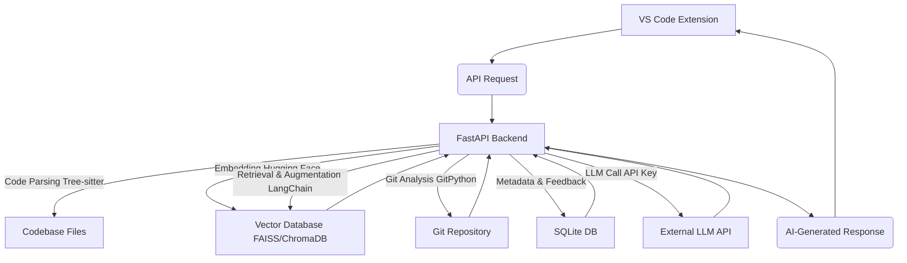

# DevFlow
AI-Powered Contextual Assistant for Codebases. Instantly understand complex code, navigate legacy systems, and accelerate onboarding with AI-driven explanations, knowledge graphs, and codebase Q&amp;A, right in your VS Code.

My project, DevFlow, is an AI-powered Developer Tool that functions as a contextual AI Agent within VS Code. It leverages advanced Natural Language Processing (NLP), specifically Retrieval-Augmented Generation (RAG), to help developers quickly understand complex codebases, accelerate onboarding, and get instant answers to their questions, significantly improving Developer Experience (DevX).

# DevFlow: Your AI-Powered Contextual Assistant for Codebases

<!-- Badges (Optional but recommended for professionalism) -->


---

<!--- ## 🚀 Demo

**Watch DevFlow in action:**
[](https://www.youtube.com/watch?v=YOUR_VIDEO_ID_HERE)
*(Replace `YOUR_VIDEO_ID_HERE` with your YouTube video ID. A short GIF like this is also highly effective if embedded directly: ``)*

---
--->
## ✨ Problem Statement

In today's fast-paced software development, developers, especially new hires, spend an exorbitant amount of time (up to **8+ hours per week** according to industry reports like Atlassian's "State of Developer Experience 2025") on non-coding tasks such as:

*   **Gathering context:** Understanding how different parts of a complex microservices architecture fit together.
*   **Navigating legacy systems:** Deciphering poorly documented or undocumented code.
*   **Onboarding:** Ramp-up time for new team members can extend for weeks or even months due to a lack of comprehensive, up-to-date documentation and tribal knowledge.
*   **Debugging:** Tracing issues across multiple services without clear data flow diagrams or explanations.

Existing AI coding assistants often focus on code generation, while documentation tools are typically static and quickly become outdated. There's a significant gap in providing **real-time, contextual understanding** directly within the developer's workflow.

---

## 💡 Solution: DevFlow

**DevFlow** is an AI-powered contextual assistant integrated directly into VS Code, designed to drastically reduce the time developers spend understanding codebases. It acts as an intelligent layer over your existing repositories, transforming raw code and internal knowledge into actionable insights.

### Key Features:

*   **Contextual Code Explanation:** Highlight any code snippet, function, or file in VS Code, and DevFlow's AI will provide an instant, concise explanation of its purpose, dependencies, and how it fits into the larger system.
*   **"Ask My Codebase" Q&A:** Engage in natural language conversations with your codebase. Ask specific questions about architecture, data flow, feature implementation, or debugging steps, and get answers grounded in your project's unique context.
*   **Automated Knowledge Graph Generation (Basic):** Visualizes key relationships and dependencies between files, modules, and services, offering a high-level architectural overview.
*   **Code Evolution Insights (Basic):** Provides a glimpse into the history of a file or module by summarizing relevant Git commit messages, offering "why" certain changes were made.
*   **Local-First Processing:** Your code and sensitive data stay on your machine, ensuring **maximum privacy and security**. Only your query and retrieved context (anonymized if desired) are sent to the external LLM API.

---

## 🌟 Why DevFlow Stands Out (Differentiator)

Unlike generic AI coding assistants or static documentation generators, DevFlow doesn't just extract comments or generate code. Its core innovation lies in:

1.  **Retrieval-Augmented Generation (RAG) with Deep Context:** DevFlow utilizes an advanced RAG pipeline. It not only embeds and retrieves relevant code chunks but also *conceptually* integrates context from internal documentation (READMEs, Markdown files) and even **simulated communication data** (e.g., Jira tickets, GitHub PR comments, mock Slack threads) for a truly holistic understanding. This allows it to answer "why" questions, not just "what."
2.  **Focus on Architectural Intent & Evolution:** It goes beyond syntactic understanding. By analyzing code structure, dependencies, and Git history, DevFlow aims to infer the *intent* behind the code and how it has *evolved*, providing insights into design decisions and potential breaking changes.
3.  **Seamless IDE Integration:** Delivered as a VS Code extension, DevFlow embeds itself directly into the developer's natural workflow, providing instant, on-demand context without breaking their flow state.

---

## 🛠 Tech Stack

**Backend & AI Core (Python):**
*   **FastAPI:** For building a robust and high-performance asynchronous API.
*   **Hugging Face Transformers:** For loading and leveraging state-of-the-art, code-aware embedding models (e.g., CodeBERT, StarCoderBase, or `sentence-transformers`).
*   **FAISS / ChromaDB:** For efficient local vector storage and similarity search for the RAG pipeline.
*   **LangChain / LlamaIndex:** For orchestrating the RAG pipeline and interacting with LLMs.
*   **Tree-sitter:** For robust, language-agnostic code parsing and Abstract Syntax Tree (AST) generation.
*   **GitPython:** For programmatic interaction with Git repositories to extract history and blame information.
*   **SQLite:** For local persistence of metadata, chunk references, and user feedback.

**Frontend & Integration (TypeScript/JavaScript):**
*   **VS Code Extension API:** For building the native IDE integration.
*   **React / TypeScript / Tailwind CSS:** For building responsive and intuitive UI components within VS Code webviews.
*   **vis.js / D3.js / Cytoscape.js:** For interactive knowledge graph visualization (within webviews).

**Containerization & Deployment:**
*   **Docker / Docker Compose:** For containerizing the backend services, ensuring easy setup and consistent environments.

---

## 🏛 Architecture Overview

DevFlow operates with a client-server architecture, where the VS Code extension acts as the client communicating with a locally running Python FastAPI backend.

*   **VS Code Extension (Frontend):** Handles UI interactions, sends requests to the local backend, and displays AI-generated responses.
*   **FastAPI Backend (Backend & ML Core):**
    *   Receives requests from the VS Code extension.
    *   Utilizes **Tree-sitter** to parse the codebase.
    *   Leverages an **embedding model** to convert code and documentation into vector embeddings.
    *   Stores and retrieves these embeddings from a **local vector database (FAISS/ChromaDB)**.
    *   Orchestrates the **RAG pipeline** using LangChain, combining retrieved context with user queries.
    *   Communicates with external **LLM APIs** (e.g., OpenAI, Anthropic) for response generation.
    *   Integrates with **GitPython** for code evolution analysis.
    *   Manages metadata in a **SQLite** database.

For a more detailed breakdown, see the [Architecture Document](docs/architecture.md).



---

## 🚀 Installation & Setup

DevFlow is designed for easy local setup via Docker Compose.

1.  **Clone the repository:**
    ```bash
    git clone https://github.com/yourusername/devflow.git
    cd devflow
    ```

2.  **Set up environment variables:**
    Copy the example environment file and add your LLM API key (e.g., OpenAI API key).
    ```bash
    cp .env.example .env
    # Open .env and add your OPENAI_API_KEY=sk-... (or equivalent for other LLMs)
    ```

3.  **Start the DevFlow Backend Services:**
    This will build and run the FastAPI backend and initialize the necessary services.
    ```bash
    docker-compose up --build -d
    ```
    *   Wait a moment for the services to spin up. You can check their status with `docker-compose ps`.

4.  **Install the VS Code Extension:**
    *   Open VS Code.
    *   Go to the Extensions view (Ctrl+Shift+X or Cmd+Shift+X).
    *   Click on `...` (More Actions) at the top of the Extensions sidebar.
    *   Select "Install from VSIX..."
    *   Navigate to the `devflow/vscode-extension/` directory (you'll need to package it first if not already done, usually `vsce package` within that directory).

---

## 📖 Usage

Once DevFlow backend services are running and the VS Code extension is installed:

1.  **Open a Codebase:** Open any project folder in VS Code.
2.  **Index the Codebase:**
    *   Open the VS Code Command Palette (Ctrl+Shift+P or Cmd+Shift+P).
    *   Search for and select "DevFlow: Index Current Workspace."
    *   Monitor the VS Code Output panel for indexing progress. This step prepares your codebase for AI understanding.
3.  **Explain Code:**
    *   Highlight any code snippet (function, class, block) in your editor.
    *   Right-click and select "DevFlow: Explain Selected Code."
    *   A pop-up or a response in the DevFlow sidebar will provide a detailed explanation.
4.  **Ask My Codebase:**
    *   Open the DevFlow sidebar panel (look for the DevFlow icon in the Activity Bar).
    *   Type your natural language question in the input box (e.g., "What does the `UserService` do?", "Explain the data flow for user registration").
    *   Press Enter, and the AI-generated answer will appear in the panel.

---

## 🗺 Roadmap & Future Enhancements

This MVP is a strong foundation. Future plans include:

*   **Advanced Knowledge Graph:** More sophisticated relationship extraction (e.g., cross-service dependencies, external API calls) and richer interactive visualizations.
*   **Real-time Communication Integration:** Secure and privacy-preserving integration with live enterprise communication platforms (e.g., Slack, Jira, Confluence) to learn from "tribal knowledge."
*   **Proactive Suggestions:** AI proactively suggesting relevant documentation or explanations based on current file context or open issues.
*   **Customizable AI Models:** Allowing users to bring their own fine-tuned or private LLMs for enhanced privacy/accuracy.
*   **Multi-language Support:** Expanding robust parsing and understanding beyond Python/TypeScript.
*   **Improved Feedback Loop:** Leveraging explicit and implicit user feedback to continuously fine-tune the RAG system and embedding models.
*   **Team Collaboration Features:** Sharing indexed knowledge graphs or common Q&A insights across a development team.

---

## 🤝 Contributing

While primarily a solo portfolio project, feel free to explore the codebase. Suggestions and feedback are always welcome!

---

## 📄 License

This project is licensed under the MIT License - see the [LICENSE](LICENSE) file for details.

---

## ✉️ Contact

Feel free to connect with me on [LinkedIn](https://www.linkedin.com/in/heyshinde) or check out my other projects on [GitHub](https://github.com/heyshinde).

---
