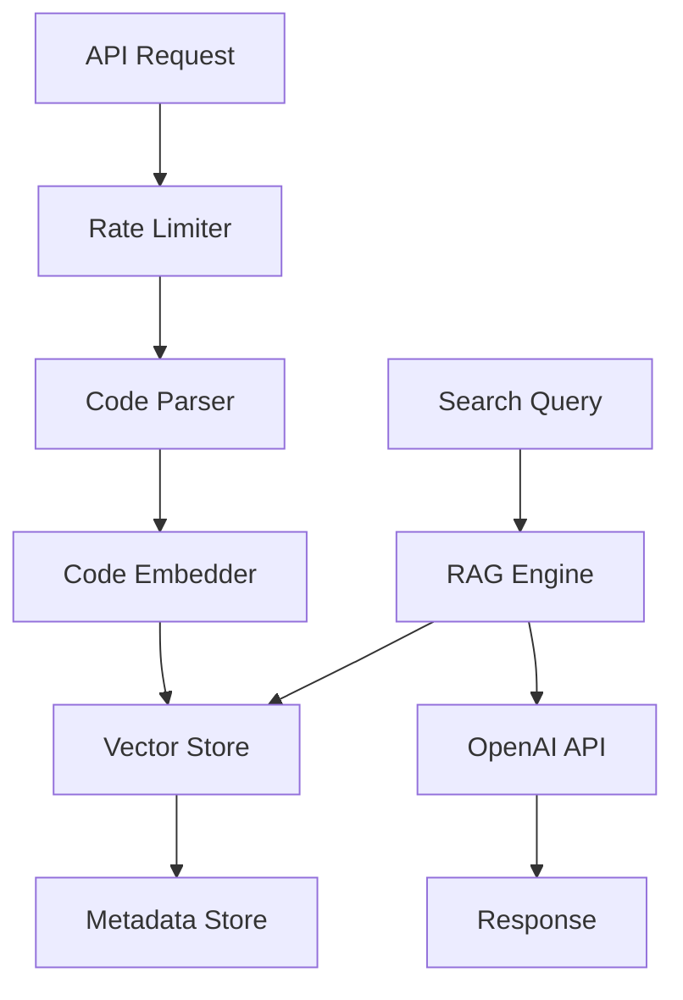

# Core Components

The DevFlow backend is built with modular components that work together to provide code indexing, search, and AI features.

---

## Code Parser (`app/services/code_parser.py`)

The code parser analyzes source code files and extracts structured information.

### Features
- **Language Detection**: Automatically detects programming languages from file extensions.
- **Function Extraction**: Identifies and extracts function definitions with metadata.
- **Class Extraction**: Finds class definitions and their methods.
- **Documentation Parsing**: Extracts docstrings and comments.

### Supported Languages
- Python, JavaScript, TypeScript, Java, Go, C++, C#, Rust, PHP, and more.

### Example Output
```python
{
  "functions": [
    {
      "name": "authenticate_user",
      "code": "def authenticate_user(username, password):\n    ...",
      "start_line": 10,
      "end_line": 25
    }
  ],
  "classes": [
    {
      "name": "UserManager",
      "code": "class UserManager:\n    ...",
      "start_line": 30,
      "end_line": 50
    }
  ]
}
```

---

## Code Embedder (`app/services/embedder.py`)

Generates vector embeddings for code snippets using language models.

### Features
- **Semantic Embeddings**: Creates high-dimensional vectors that capture code meaning.
- **Batch Processing**: Efficiently processes multiple code snippets.
- **Model Selection**: Configurable embedding models.
- **Caching**: Caches embeddings for improved performance.

### Embedding Process
1. Code is preprocessed and cleaned.
2. Text is tokenized and sent to the embedding model.
3. High-dimensional vectors are generated and stored.

---

## Vector Store (`app/db/vector_store.py`)

Manages the storage and retrieval of code embeddings using ChromaDB.

### Features
- **Persistent Storage**: Embeddings are stored on disk for persistence.
- **Similarity Search**: Fast vector similarity search across the codebase.
- **Metadata Storage**: Stores additional information with each embedding.
- **Collection Management**: Organizes embeddings by project or workspace.

### Operations
- `add_vectors()`: Store new embeddings
- `search()`: Find similar code snippets
- `clear()`: Remove all embeddings
- `get_stats()`: Retrieve storage statistics

---

## Metadata Store (`app/db/metadata_store.py`)

Manages file and chunk metadata in a SQLite database.

### Features
- **File Tracking**: Records all indexed files with timestamps.
- **Chunk Management**: Tracks individual code chunks and their relationships.
- **Embedding Mapping**: Links chunks to their vector embeddings.
- **Feedback System**: Stores user feedback on code chunks.

### Database Schema
```sql
-- Files table
CREATE TABLE files (
    id INTEGER PRIMARY KEY,
    path TEXT UNIQUE,
    created_at TIMESTAMP
);

-- Chunks table
CREATE TABLE chunks (
    id TEXT PRIMARY KEY,
    file_id INTEGER,
    type TEXT,
    name TEXT,
    start_line INTEGER,
    end_line INTEGER,
    embedding_id TEXT
);
```

---

## RAG Engine (`app/services/rag_engine.py`)

Retrieval-Augmented Generation for AI-powered code answers.

### Features
- **Context Retrieval**: Finds relevant code snippets for questions.
- **AI Integration**: Connects with OpenAI for natural language responses.
- **Prompt Engineering**: Optimized prompts for code-related questions.
- **Response Generation**: Creates context-aware answers.

### Process
1. User question is received.
2. Relevant code chunks are retrieved from vector store.
3. Context is formatted and sent to OpenAI.
4. AI generates a comprehensive answer.

---

## Cache Service (`app/services/cache.py`)

Provides caching layer for improved performance.

### Features
- **In-Memory Caching**: Fast access to frequently used data.
- **TTL Support**: Automatic expiration of cached items.
- **Cache Invalidation**: Smart cache management.
- **Performance Monitoring**: Track cache hit rates.

### Cached Data
- Search results
- Embeddings
- File metadata
- API responses

---

## Rate Limiter (`app/services/rate_limiter.py`)

Prevents API abuse and ensures fair usage.

### Features
- **Request Limiting**: Limits requests per time window.
- **IP-based Tracking**: Tracks requests by client IP.
- **Configurable Limits**: Adjustable rate limits via environment variables.
- **Graceful Degradation**: Returns appropriate error responses.

### Configuration
```python
RATE_LIMIT_REQUESTS = 100  # requests per window
RATE_LIMIT_WINDOW = 3600   # seconds
```

---

## How Components Work Together



### Indexing Flow
1. **API** receives indexing request
2. **Code Parser** analyzes source files
3. **Code Embedder** generates vectors
4. **Vector Store** stores embeddings
5. **Metadata Store** records file/chunk info

### Search Flow
1. **API** receives search query
2. **RAG Engine** retrieves relevant chunks
3. **Vector Store** performs similarity search
4. **OpenAI** generates answer (if AI query)
5. **API** returns results

---

## Configuration

All components can be configured via environment variables:

```bash
# Embedding Model
EMBEDDING_MODEL=text-embedding-ada-002

# Vector Store
CHROMA_DB_PATH=./data/vector_store

# Cache Settings
CACHE_TTL=3600

# Rate Limiting
RATE_LIMIT_REQUESTS=100
RATE_LIMIT_WINDOW=3600
```

The modular design allows for easy customization and extension of individual components. 