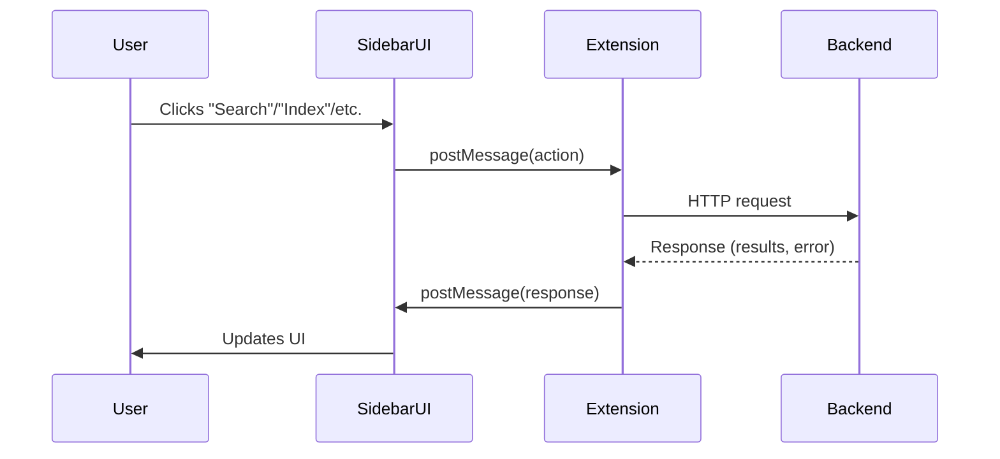

# Backend Communication

The DevFlow extension manages and communicates with a Python backend server to provide AI-powered features.

---

## Backend Process Management

- The extension can automatically set up, start, and stop the backend server.
- Uses a Python virtual environment and installs dependencies on first run.
- Backend can also be started/stopped manually from the sidebar or command palette.

---

## Communication Flow

- The extension communicates with the backend via HTTP (default: `http://localhost:8000/api`).
- User actions in the sidebar (search, index, etc.) send requests to the backend.
- The backend processes the request (search, embeddings, AI, etc.) and returns results.
- Results are displayed in the sidebar UI.

---

## Health Checks & Error Handling

- The extension checks backend health before sending requests.
- If the backend is not running or unhealthy, the user is notified in the UI.
- Logs and errors are shown in the "Logs" tab for troubleshooting.

---

## Webview Messaging

- The sidebar UI (webview) communicates with the extension host using VS Code's messaging API.
- Messages are sent for user actions, and responses are handled to update the UI.

---

## Diagram

