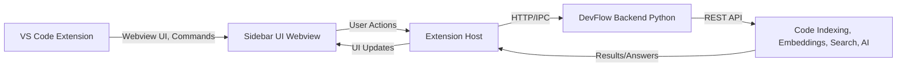

# Introduction

## What is DevFlow?

**DevFlow** is an AI-powered contextual assistant for developers, designed to supercharge your workflow inside Visual Studio Code. It enables you to search, understand, and manage your codebase using natural language, advanced code analysis, and repository insights—all from a modern, interactive sidebar UI.

DevFlow consists of a VS Code extension (frontend) and a Python backend server. The extension provides a seamless user interface, while the backend handles code indexing, embeddings, and AI-powered responses.

---

## Key Features

- **AI-Powered Code Search**: Search your codebase using natural language or keywords. Find functions, classes, and files instantly.
- **Contextual AI Answers**: Ask questions about your codebase and get context-aware answers powered by advanced language models.
- **Find Similar Code**: Paste a code snippet and discover similar patterns or functions across your project.
- **Repository Insights**: View statistics, language breakdowns, and manage your code index with ease.
- **Integrated Backend**: The extension can automatically set up and manage the backend server for you.
- **Customizable AI Settings**: Choose your OpenAI model, set token limits, and manage your API key securely.
- **Real-Time Logs & Health Checks**: Monitor backend logs and check system health directly from the sidebar.
- **Modern, Responsive UI**: Enjoy a beautiful, tabbed interface that adapts to your workflow.

---

## High-Level Architecture

Below is a high-level overview of how DevFlow works:

- **VS Code Extension**: Provides the sidebar UI, commands, and manages backend lifecycle.
- **Sidebar UI**: Interactive webview for search, answers, repo management, and settings.
- **Backend (Python)**: Handles code parsing, indexing, embeddings, and serves AI-powered responses via REST API.
- **Communication**: The extension communicates with the backend over HTTP, sending user queries and receiving results.

---

DevFlow is designed to be extensible, easy to set up, and powerful for both small and large codebases. 